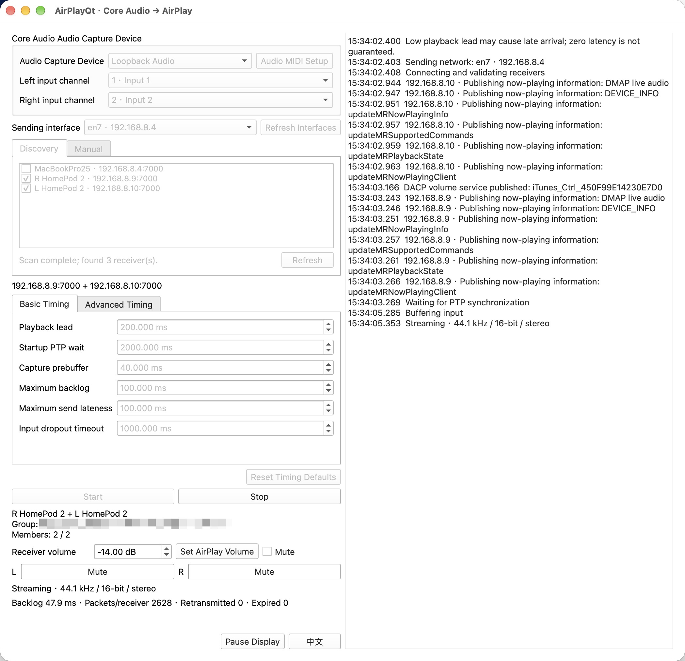

# AirPlayQt

[中文](README.md) | [English](README.en.md)

Stream live audio to an AirPlay receiver or an existing AirPlay stereo pair from a standalone app or a VST3 effect plugin.

Built with C++20 and Qt Widgets for Windows x64, macOS, and 64-bit Linux.



## Features

- **Standalone capture:** ASIO inputs on Windows; Core Audio inputs and output-device auto loopback on macOS.
- **Linux capture:** PipeWire inputs, including system-decoded Bluetooth AAC/SBC; silence during interruptions and recovery of the selected source.
- **VST3 input:** stereo audio from your DAW, with unchanged local Float32/Float64 passthrough.
- **Receiver selection:** automatic discovery or manual IPv4 address entry.
- **Volume control:** receiver native volume and mute.
- **English and Chinese UI:** switch instantly; the app and each plugin instance save their language independently.

## Quick start

For Bluetooth audio input and AirPlay playback on Linux, see the [Linux user guide](doc/linux/README.en.md) ([中文](doc/linux/README.md)).

1. Open the app, or insert AirPlayQt as an effect on a stereo track or bus in your DAW.
2. For the app, select a capture device and left and right input channels (which may be the same). On macOS, output devices are labeled `(auto loopback)`. For VST3, use a 44.1 kHz project with real-time processing enabled.
3. Select one receiver or both members of an existing AirPlay stereo pair. Manual addresses use `IPv4[:port]`, with port `7000` as the default.
4. Choose a network interface if needed, then click **Start**.
5. Adjust receiver volume or mute during playback. Click **Stop** to end the session.

Sending requires **44.1 kHz** audio. On Linux, PipeWire converts input to this rate and adapts its clock; Windows/macOS inputs must already supply 44.1 kHz. AirPlayQt converts input to stereo 16-bit PCM for the ALAC transport. Stereo-pair channel roles come from the AirPlay group, not selection order. Discovery alone does not guarantee receiver compatibility.

The VST3 plugin keeps local audio passing through and reports zero local latency; remote playback has its own buffering delay. Closing the plugin editor leaves sending active. A streaming instance can reconnect once if valid host audio resumes within five seconds of suspension.

Logs belong to the current editor window. Closing it discards its logs; reopening starts with an empty log and shows only new messages, without replaying messages produced while the editor was closed.

On macOS, allow microphone access for input devices, system audio recording for auto loopback, and local network access for AirPlay.

> **macOS audio capture:** Please use a loopback virtual audio device. **Loopback by Rogue Amoeba** has been tested; **BlackHole** has not been tested. In Loopback, connect the audio inputs to the output channels. AirPlayQt's built-in **auto loopback** may produce audio distortion.
>
> **Windows audio capture:** Please install an ASIO-compatible virtual audio device, such as **VB-Audio Matrix**, and connect the audio inputs to the outputs in its routing configuration, similarly to Loopback on macOS.

Auto loopback captures applications playing through the selected output device using native Core Audio taps; no virtual audio driver is required. Local playback of the tapped audio is muted while capture runs and resumes when capture stops. Selecting a device alone does not mute it. AirPlayQt does not change the system default output, device volume, or sample rate. Set the output device to **44.1 kHz** in **Audio MIDI Setup** before starting. Multi-stream output channels are listed in device stream order; choose left and right input channels (which may be the same). For a mono device, select its channel for both inputs. Device removal or format changes stop sending; select the device again before restarting. Any native cleanup failure is reported and must be retried before switching capture devices.

The Windows app requests real-time process priority and exits if that request fails; elevated execution may be required.

## Build

### Requirements

- CMake 3.25+, a C++20 compiler, and Ninja for Ninja-based presets.
- Qt 6.5+ with Core, Widgets, Network, and Test.
- OpenSSL and libplist 2.7+; non-MSVC builds also require pkg-config.
- Steinberg VST3 SDK for the plugin, provided as a Git submodule.
- Steinberg ASIO SDK for the Windows standalone app.

Initialize the SDK from the repository root:

```sh
git submodule update --init --recursive
```

The presets in [CMakePresets.json](CMakePresets.json) contain machine-specific paths. Adjust compiler, dependency, SDK, and environment paths for your installation before configuring. Run the commands below from the repository root.

### Linux

See the Linux user guide ([English](doc/linux/README.en.md) / [中文](doc/linux/README.md)) for Bluetooth input, installation permissions and recovery behavior. Linux supports the standalone GUI and optional headless `AirPlayQtCli`; VST3 is not supported.

```sh
cmake --preset linux-release
cmake --build --preset linux-release -j "$(nproc)"
ctest --preset linux-release --output-on-failure
```

### macOS

The supplied preset targets **Apple Silicon and macOS 27.0+**, using Apple Clang and Homebrew dependency paths.

```sh
cmake --preset macos-release -DBUILD_TESTING=ON -DAIRPLAY_CLI_TEST=OFF
cmake --build --preset macos-release
ctest --preset macos-release
```

Outputs:

- App: `build/macos-release/AirPlayQt.app`
- Plugin: `build/macos-release/VST3/Release/AirPlayQt.vst3`

Development builds use local dependencies. To create bundles with their runtime libraries included:

```sh
cmake --build --preset macos-release --target package-macos
```

Packages are written to `dist/macos-arm64`. They are ad-hoc signed.

### Windows

The `msvc` preset uses Visual Studio 2026 with the v143 x64 toolset and Release Qt/OpenSSL libraries under `build/msvc-deps/Library`. Set `ASIO_SDK_ROOT` to your ASIO SDK and `LIBPLIST_ROOT` to a libplist installation containing its C headers and DLL.

```sh
cmake --preset msvc
cmake --build --preset msvc-release
ctest --preset msvc-release
```

Outputs:

- App: `build/msvc/Release/AirPlayQt.exe`
- Plugin: `build/msvc/VST3/Release/AirPlayQt.vst3`

The MSVC build deploys runtime dependencies beside the app and inside the plugin bundle. Keep these files together; install the complete `.vst3` directory in your host's plugin location and rescan.

MSYS2 CLANG64 is also available through the `debug` and `release` presets. Its VST3 SDK requires the [aligned-allocation patch](patches/vst3sdk-clang64-aligned-allocation.patch); check and apply it to a fresh SDK checkout before building:

```sh
git -C external/vst3sdk/public.sdk apply --check ../../../patches/vst3sdk-clang64-aligned-allocation.patch
git -C external/vst3sdk/public.sdk apply ../../../patches/vst3sdk-clang64-aligned-allocation.patch
cmake --preset release
cmake --build --preset release
ctest --preset release
```

CLANG64 builds require their runtime DLLs and Qt plugins to be available to the app and host process.

### Build options

| Option | Default | Purpose |
| --- | --- | --- |
| `AIRPLAY_BUILD_STANDALONE` | `ON` | Build the input capture app. |
| `AIRPLAY_BUILD_VST3` | `ON` (`OFF` on Linux) | Build the VST3 plugin. |
| `AIRPLAY_CLI_TEST` | `OFF` | Enable the macOS app's CLI test entry point. |
| `AIRPLAY_VST_RATE_DIAGNOSTICS` | `OFF` | Enable VST input/send rate diagnostics. |
| `AIRPLAY_RELEASE_VERSION` | `0.1.0` | Application, macOS bundle and VST3 version in `X.Y.Z` format. |

Pass options during configuration, for example `cmake --preset macos-release -DAIRPLAY_BUILD_VST3=OFF`. A plugin-only build does not require the ASIO SDK.
